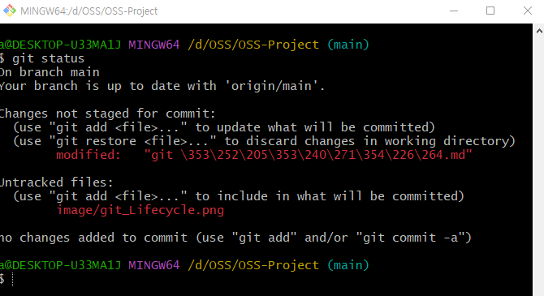

# Git 명령어

##  git init  
* git 저장소 초기화. 명령어를 입력하기 전까지는 일반 디렉토리였지만, 초기화를 시키면 해당 디렉토리를 로컬 깃 저장소로 등록해 준다.  

<!--    -->


##  git clone  
* 원격저장소로 부터 프로젝트를 복제하는 것을 말한다.
* 저장소를 clone 하면 ‘origin’ 이라는 리모트 저장소가 자동으로 등록된다.    


##  git remote  
* 현재 프로젝트에 등록된 리모트 저장소를 확인할 수 있다.
* -v 옵션을 주면 단축이름과 URL을 함께 볼 수 있다.    
  

##  git config  
* git 사용 환경 설정 확인하고 변경할 수 있다.  


##  git add
* 작업 디렉토리 상의 변경 내용을 스테이징 영역에 추가하기 위해 사용하는 명령어.   
    ``` $ git add <파일/디렉토리 경로>``` : 변경 내용의 일부만 스테이징 영역에 넘기고 싶을 때 디렉토리의 경로를 인자로 넘긴다.  
    ```$ git add . ```:  현재 디렉토리의 모든 변경 내용을 스테이징 영역으로 넘기고 싶을 때 인자로 넘긴다. (상위 디렉토리의 변경 내용은 포함하지 않음)   
    ``` $ git add -A``` : 작업 디렉토리 상에 어디에 위치하든 항상 동일하게 모든 변경 내용을 스테이징으로 넘긴다.   
       
    

##  git commit -m “commit message”
* 파일 및 폴더의 추가/변경 사항을 저장소에 기록한다.
* 인덱스(staging area)에 등록되어 있는 파일 상태를 기록한다.   

    

## git push
* 로컬 저장소의 commit 내역을 remote 저장소로 전송한다.
* ``` -u ``` 옵션은 upstream repository를 설정해준다. 즉 한번 설정한 후로는 git push, git pull 만 간단히 쓸 수 있다.
    ```
    git push [remote] [branch]

    git push -u origin main
    ```

## git pull 
* 원격저장소로 부터 변경된 내용을 가지고 온 후 병합(merge)
* pull = fetch + merge 와 같은 의미!
    ```
    git pull
    ```

##  git log
* git log는 현재 브랜치의 커밋 이력을 볼 수 있는 명령어이다  
   
    ```
   $ git log : 현재 브랜치의 커밋 이력을 보는 명령어, HEAD와 관련된 커밋들이 자세하게 나온다  
   $ git log --oneline : 커밋 이력 중 커밋 ID 와 타이틀 메시지만 조회   
   $ git log --oneline --decorate --graph --all : 모든 브랜치의 커밋 이력을 보는 명령어   
   $ git log -n <숫자> : 현재 브랜치의 커밋 이력을 보는 명령어   
    ```
<br>  

## git LifeCycle
* 워킹 디렉토리의 파일은 먼저 크게 Untracked, Tracked의 두 가지 상태로 나뉜다.(워킹 디렉토리는 작업중인 로컬 컴퓨터의 공간입니다.) 
    * ``` Tracked ``` : 파일에 수정이 일어나면 git이 파일의 변경을 감지하여 사용자에게 알려주는 것과 같이 파일을 추적하는 상태   
    * ``` Untracked ``` : 파일을 저장소에 저장할 필요가 없어 git이 신경쓰지 않아도 되는 상태   

* Tracked 상태의 파일들은 다시 크게 Unmodified, Modified, Staged 3개의 상태로 나뉩니다.   
    * Staged : staging area에 있는 파일들의 상태    
    * Unmodified : staging area에 있는 파일들을 커밋하게 되면 해당 파일들은 하나의 커밋으로 저장된 후, 파일의 상태는 Unmodified로 내려오게 됩니다.  
    * Modified : Unmodified 상태의 파일들을 수정하게 되면 Modified 상태가 됩니다.    

* 이후 다시 git add 명령어를 이용하여 Staged 상태로 올려준 후 커밋을 하는 과정을 반복하게 됩니다


<br>

##  git status  
* 파일들의 가능한 상태를 확인할 수 있다. 관리되고 있는 파일과 디렉토리 목록을 확인해 볼 수 있다. 
* 작업 디렉토리(working directory)와 스테이징 영역(staging area)의 상태를 확인하기 위해 사용한다.   
   


## git branch 
* 브랜치를 관리하는 도구, 브랜치를 모두 보여주고 브랜치를 새로 만들고 브랜치를 삭제하고 브랜치 이름을 변경한다.
    ```
    $ git branch : 로컬 branch 목록 확인
    $ git branch -a : 원격 저장소를 포함한 모든 branch 목록 확인
    $ git branch [브랸치명]: branch 생성하기
    $ git branch -d [브랜치명] : branch 삭제
    ```

## git checkout
* 브랜치를 변경하고 해당 파일을 워킹 디렉토리로 복사한다.
    ```
    $ git checkout [브랜치명] : branch 변경하기
    $ git checkout -b [브랜치명] : branch를 새로 생성하고 변경하기
    ```

## git switch
* branch를 변경하는 명령어 입니다. checkout 에서 복원하는 기능을 제거했다고 합니다.
    ```
    $ git switch [브랜치명] : branch 변경하기
    $ git switch -b [브랜치명] : branch를 새로 생성하고 변경하기
    ```

##  git fetch
* 원격저장소로 부터 변경된 내용을 가지고 온 후 병합 x
* 변경된 내역을 가지고 온 후 검토 후에 merge 할 수 있어서 충돌 방지
* --prune 옵션으로 remote 저장소에 지워진 브랜치를 local 반영하여 local의 불필요한 branch를 삭제한다.
    ```
    git fetch [remote]

    git fetch --prune
    ```

## git merge 
* 브랜치를 병합하는 명령어
* 협업 과정에서 같은 이름의 파일 안에 수정한 부분이 겹칠 때 충돌(conflit)이 발생 할 수 있다.
    ```
    $ git merge [브랜치명] : 현재브랜치에서 대상브랜치를 병합시킴
    $ git merge --abort : 병합 충돌(Conflict) 발생 시 취소
    $ git merge -Xignore-all-space : 공백으로 인한 병합 충돌을 무시하고 병합
    ```
- Fast-Forward
    - 순차적 커밋에 맞추어 병합을 처리하는 방식 일반적으로 혼자 개발할 때 사용 브랜치 경로가 일직선 모양일 때 병합 작업을 하면, Fast-Foword 방식의 알고리즘이 적용 (소스트리 모양)
    - main branch ->  신규 commit이 없을 경우 자동으로 fast-forward merge 발동
    - git merge —no-ff : 강제 3-way merge 가능
       


- 3-way merge
    - 두 브랜치가 base에서 분리된 commt을 참조할 때 git merge 명령을 실행하면 새로운 commit이 생성된다. 이와 같은 merge를 3-way merge 라고 한다.
    - 새로운 commit branch 생성
    - git flow : feature/develop 브랜치에서 많이 사용
       

        ```
        1) --ff  
        $ git merge [병합할 브랜치 명]    
        merge를 진행할 때 아무 옵션을 주지 않는 경우이며, 위에서 살펴보았던 Merge 방법과 
        동일하다.   
        현 브랜치와 병합할 브랜치가 Fast-forward 관계이면 Fast-forward 병합을 진행하며, 
        그렇지 않은 경우는 Merge 커밋을 생성하여 3 way-merge를 진행한다.   


        2) --no-ff   
        $ git merge --no-ff [병합할 브랜치 명]  
        현재 브랜치와 병합 대상의 관계가 Fast-forward관계 여부와 상관없이 
        Merge 커밋을 생성하여 병합한다.     


        3) --ff-only   
        $ git merge --ff-only [병합할 브랜치 명]     
        현재 브랜치와 병합 대상의 관계가 Fast-forward인 경우에만 병합을 진행한다. 
        Merge 커밋 생성되지 않는다.   


        4) --squash
        $ git merge --squash [병합할 브랜치 명]   
        ```


## git rebase
* branch의 시작점을 이동시켜 3-way merge → fast-forward merge처럼 만들어줄 수 있다.
* rebase: branch 시작점을 다른 commit으로 옮겨주는 행위
* rebase 쓰는 이유 : 3 way-merge를 하지 않고도 깔끔하게 branch를 관리하므로 history나 log확인이 쉬움
* 단점 : conflict가 자주 일어남
* -i는 interactive라는 옵션이다. 해당 옵션을 사용하면 중간에 낀 커밋 메세지를 수정할 수 있다.
    ```
    $ git rebase origin/master : # 원격 저장소(origin)의 master 브랜치로 rebase 
    ```
       

## git reset
* reset은 특정 사건으로 되돌아가게 되는데 과거로 되돌아 갔으니 해당 사건 이후의 사건들은 모두 사라집니다.
    ```
    $ git reset [옵션] [돌아가고싶은 커밋id]
    $ git reset –soft [돌아가고싶은 커밋id] : index 보존(add한 상태, staged 상태), 워킹 디렉터리의 파일 보존. 즉 모두 보존.
    $ git reset –mixed [돌아가고싶은 커밋id]: index 취소(add하기 전 상태, unstaged 상태), 워킹 디렉터리의 파일 보존 (기본 옵션)
    $ git reset –hard [돌아가고싶은 커밋id]: index 취소(add하기 전 상태, unstaged 상태), 워킹 디렉터리의 파일 삭제. 즉 모두 취소.
    ```
## git revert
* 특정 사건을 골라서 없던일로 만듭니다. 또한 앞서 말한 것처럼 과거 특정 사건을 없에주지만 revert를 했다는 이력이 남게 됩니다. 

    ```
    $ git revert [돌아가고 싶은 커밋 id]
    ```
